# **<center>Final Project Analisis Big Data</center>**

:max_bytes(150000):strip_icc()/Spotify-089b80c169d44fcfa110aebc6801289f.jpg)

# <center>Eksplorasi Analisis Musik Spotify: Wawasan Mendalam tentang Genre, Fitur, dan Tren</center>

## **Team Members**

   * [Taufik Suryo Abintoro](https://github.com/)       : 202110370311510
   * [Febriansyah Ilham Nur Wakit](https://github.com/) : 202110370311511
   * [Haidar Zakki Jumali](https://github.com/)         : 202110370311514
   

<!--Daftar Isi-->

## Daftar Isi

- [Pendahuluan](#pendahuluan)
- [Package yang Diperlukan](#package-yang-diperlukan)
- [Data Preparation](#data-preparation)
- [Eksplorasi dan Analisa Data](#eksplorasi-dan-analisa-data)
- [Kesimpulan](#kesimpulan)
- [Others](#Others)
  <br><br>

<!--PENDAHULUAN-->

## Pendahuluan

<div align='justify'>
Proyek ini bertujuan untuk mengeksplorasi dan menganalisis data lagu-lagu Spotify dengan fokus pada genre, fitur audio, dan tren yang muncul. Melalui eksplorasi data (EDA), analisis ini bertujuan untuk mengidentifikasi pola-pola musik yang relevan dan memberikan wawasan tentang hubungan antar genre dan fitur yang mempengaruhi popularitas lagu. Sebagai tambahan, K-Nearest Neighbors (KNN) serta K-MEANS digunakan untuk memberikan rekomendasi berdasarkan pola-pola musik yang terdeteksi, meskipun fokus utama dari proyek ini adalah analisis eksplorasi data dan pemahaman karakteristik musik seperti danceability, energy, dan acousticness.

### 1.1 Rumusan Masalah

Berdasarkan latar belakang yang telah ditulis di atas, maka rumusan masalah yang dapat difokuskan pada penelitian ini yaitu, tujuan dari proyek ini adalah untuk menggali pola-pola dan tren yang ada dalam dataset lagu Spotify.

1. Menganalisis hubungan antara fitur-fitur audio (seperti danceability, energy, acousticness) dan lainnya dengan genre musik.
2. Membangun sistem rekomendasi menggunakan KNN untuk merekomendasikan lagu-lagu berdasarkan kesamaan fitur musik.
3. Mengidentifikasi genre, fitur dan tren yang mendominasi playlist tertentu dan memahami faktor-faktor yang mempengaruhi popularitas lagu di platform Spotify.

### 1.2 Rumusan Masalah

sebelumnya, rumusan masalah yang akan difokuskan dalam penelitian ini adalah sebagai berikut:

1. Bagaimana hubungan antara fitur-fitur audio, seperti danceability, energy, dan acousticness, dengan genre musik yang ada?
2. Bagaimana cara membangun sistem rekomendasi menggunakan KNN untuk merekomendasikan lagu-lagu berdasarkan kesamaan fitur musik?
3. Faktor-faktor apa yang mempengaruhi dominasi genre, fitur, tren dalam playlist tertentu serta bagaimana hal ini mempengaruhi popularitas lagu di platform Spotify?

### 1.3 Solution & Methodology

Untuk memberikan solusi pada permasalahan ini, kami akan menggunakan teknik analisis berikut:

1. Pembersihan Data dan Analisis Deskriptif Awal: Membersihkan data untuk memastikan kualitas analisis dan melakukan analisis statistik deskriptif untuk mengidentifikasi tren utama.
2. Eksplorasi Data (EDA): Melakukan visualisasi data untuk mengungkap hubungan antar fitur audio dan genre musik.
3. Pengelompokan (K-means) dan Rekomendasi (KNN): Menggunakan K-means untuk mendeteksi pola dalam grup musik dan menerapkan KNN untuk memberikan rekomendasi lagu berdasarkan kesamaan fitur.

### 1.4 Analysis Implication & Benefit

Analisis ini diharapkan dapat memberikan manfaat sebagai berikut:

1. Wawasan Tren Musik: Menyediakan wawasan mengenai tren musik dan genre yang mendominasi di platform Spotify.
2. Analisis Fitur: Memahami bagaimana fitur audio seperti energy dan danceability mempengaruhi popularitas genre dan playlist tertentu.
3. Rekomendasi Lagu yang Lebih Akurat: Meningkatkan akurasi rekomendasi lagu menggunakan sistem berbasis KNN.
4. Potensi untuk Industri Musik: Menawarkan wawasan berharga untuk kurator musik, produser, dan pemasar dalam mengembangkan musik yang lebih populer dan relevan dengan audiens

</div>
<br>

<!--PACKAGE YANG DIPERLUKAN-->

## Package yang Diperlukan

### 2.1 Python And Jupyter Notebook

Analisis dijalankan pada Vscode dengan ekstensi Jupyter Notebook. Instalasi beberapa library pyton juga diperlukan. Jika anda ingin menjalankan di IDE masing-masing, anda dapat melakukan instalasi library pada terminal python menggunakan `pip`, perintah ini akan melakukan instalasi versi terbaru : 

```sh
pip install pandas
pip install numpy
pip install matplotlib
pip install seaborn
pip install plotly
pip install scikit-learn
```

Note : Penggunaan PDM untuk asistensi instalasi dependencies dengan mudah dapat dibaca melalui dokumentasi berikut. [PDM](https://pdm-project.org/) 

### 2.2 Pesan dan Peringatan yang Dihilangkan

Untuk menjaga notebook tetap bersih dari pesan atau peringatan yang tidak diperlukan, perintah berikut digunakan:

```sh
import warnings
warnings.filterwarnings('ignore')
```

<!--DATA PREPARATION-->

## Data Preparation

### 3.1 Sumber Data

Dataset berasal dari proyek [TidyTuesday](https://github.com/rfordatascience/tidytuesday) terkhususnya [Dataset](https://github.com/rfordatascience/tidytuesday/blob/main/data/2020/2020-02-11/readme.md) dan dikumpulkan menggunakan paket [`spotifyr`](https://github.com/charlie86/spotifyr). Data dirilis pada **21 Januari 2020** dan dapat diakses melalui tautan berikut: [spotify_songs.csv](https://raw.githubusercontent.com/rfordatascience/tidytuesday/main/data/2020/2020-01-21/spotify_songs.csv).

Paket `spotifyr` digunakan untuk mendapatkan metadata lagu dari API Spotify, mencakup informasi seperti popularitas lagu, nama artis, album, genre, serta atribut audio (danceability, energy, valence, dll.).

### 3.2 Spesifikasi Data

- Tujuan Awal Data : Data ini dikhususkan untuk analisis spotify.

- Jumlah Variabel : Dataset ini mencakup 19 variabel. Dictionary data ini adalah sebagai berikut.

|variable                 |class     |description |
|:---|:---|:-----------|
|track_id                 |character | Song unique ID|
|track_name               |character | Song Name|
|track_artist             |character | Song Artist|
|track_popularity         |double    | Song Popularity (0-100) where higher is better |
|track_album_id           |character | Album unique ID|
|track_album_name         |character | Song album name |
|track_album_release_date |character | Date when album released |
|playlist_name            |character | Name of playlist |
|playlist_id              |character | Playlist ID|
|playlist_genre           |character | Playlist genre |
|playlist_subgenre        |character | Playlist subgenre|
|danceability             |double    | Danceability describes how suitable a track is for dancing based on a combination of musical elements including tempo, rhythm stability, beat strength, and overall regularity. A value of 0.0 is least danceable and 1.0 is most danceable. |
|energy                   |double    | Energy is a measure from 0.0 to 1.0 and represents a perceptual measure of intensity and activity. Typically, energetic tracks feel fast, loud, and noisy. For example, death metal has high energy, while a Bach prelude scores low on the scale. Perceptual features contributing to this attribute include dynamic range, perceived loudness, timbre, onset rate, and general entropy. |
|key                      |double    | The estimated overall key of the track. Integers map to pitches using standard Pitch Class notation . E.g. 0 = C, 1 = C♯/D♭, 2 = D, and so on. If no key was detected, the value is -1. |
|loudness                 |double    | The overall loudness of a track in decibels (dB). Loudness values are averaged across the entire track and are useful for comparing relative loudness of tracks. Loudness is the quality of a sound that is the primary psychological correlate of physical strength (amplitude). Values typical range between -60 and 0 db.|
|mode                     |double    | Mode indicates the modality (major or minor) of a track, the type of scale from which its melodic content is derived. Major is represented by 1 and minor is 0.|
|speechiness              |double    | Speechiness detects the presence of spoken words in a track. The more exclusively speech-like the recording (e.g. talk show, audio book, poetry), the closer to 1.0 the attribute value. Values above 0.66 describe tracks that are probably made entirely of spoken words. Values between 0.33 and 0.66 describe tracks that may contain both music and speech, either in sections or layered, including such cases as rap music. Values below 0.33 most likely represent music and other non-speech-like tracks. |
|acousticness             |double    | A confidence measure from 0.0 to 1.0 of whether the track is acoustic. 1.0 represents high confidence the track is acoustic.|
|instrumentalness         |double    | Predicts whether a track contains no vocals. "Ooh" and "aah" sounds are treated as instrumental in this context. Rap or spoken word tracks are clearly "vocal". The closer the instrumentalness value is to 1.0, the greater likelihood the track contains no vocal content. Values above 0.5 are intended to represent instrumental tracks, but confidence is higher as the value approaches 1.0. |
|liveness                 |double    | Detects the presence of an audience in the recording. Higher liveness values represent an increased probability that the track was performed live. A value above 0.8 provides strong likelihood that the track is live. |
|valence                  |double    | A measure from 0.0 to 1.0 describing the musical positiveness conveyed by a track. Tracks with high valence sound more positive (e.g. happy, cheerful, euphoric), while tracks with low valence sound more negative (e.g. sad, depressed, angry). |
|tempo                    |double    | The overall estimated tempo of a track in beats per minute (BPM). In musical terminology, tempo is the speed or pace of a given piece and derives directly from the average beat duration. |
|duration_ms              |double    | Duration of song in milliseconds |

### 3.3 Data Cleaning

* Pemeriksaan data duplikat: Memastikan tidak ada data yang terduplikasi, yang dapat mempengaruhi hasil analisis dan visualisasi.
* Pemeriksaan data null: Menghapus data dengan nilai kosong (null) untuk menghindari kerancuan.
* Perbaikan format tanggal: Mengubah format tanggal yang salah agar sesuai, seperti pada track_album_release_date.

### 3.4 Data Cleaned Information
* Jumlah Data: Terdapat 32,828 entri dalam dataset, dengan 23 kolom.

* Statistik Deskriptif:

    * track_popularity: Nilai rata-rata 42.48, dengan rentang dari 0 hingga 100.
    * danceability dan energy: Rata-rata masing-masing 0.65 dan 0.70, dengan distribusi yang skewed.
    * loudness: Rata-rata -6.72 dB, dengan variasi yang cukup besar (rentang dari -46.45 hingga 1.28).
    * speechiness, acousticness, instrumentalness, dan liveness memiliki rata-rata rendah, menunjukkan nilai yang tidak terlalu dominan.
    * valence: Nilai rata-rata 0.51, cenderung seimbang (mendekati nilai tengah).
    * tempo: Rata-rata 120.88 BPM, menunjukkan tempo rata-rata yang cepat.
    * duration_ms: Durasi rata-rata lagu sekitar 226 detik.

* Rentang Data:

    * track_popularity: Rentang dari 0 hingga 100.
    * duration_ms: Durasi lagu berkisar antara 4,000 ms hingga 517,810 ms.

* Distribusi Kolom:

    * key dan mode memiliki rentang yang terbatas, menunjukkan nilai yang terstandarisasi.
    * speechiness, acousticness, instrumentalness, dan liveness menunjukkan rentang nilai yang lebih kecil dan lebih terpusat di sekitar nilai rendah.
    * Memory Usage: Dataset menggunakan sekitar 5.8 MB memori, cukup efisien untuk ukuran data yang besar

* **TIPE DATA**  
    * 9 kolom bertipe float64 (nilai numerik).
    * 4 kolom bertipe int64 (nilai numerik integer).
    * 9 kolom bertipe object (nilai kategorikal atau string).
    * 1 kolom bertipe datetime64[ns] (nilai tanggal dan waktu).

## Exploratory Data Analysis

<div align='justify'>

### 1. **Hubungan antara popularitas rata-rata berdasarkan genre playlist.**

<p align='center'>
<a href="#" align='center'>
    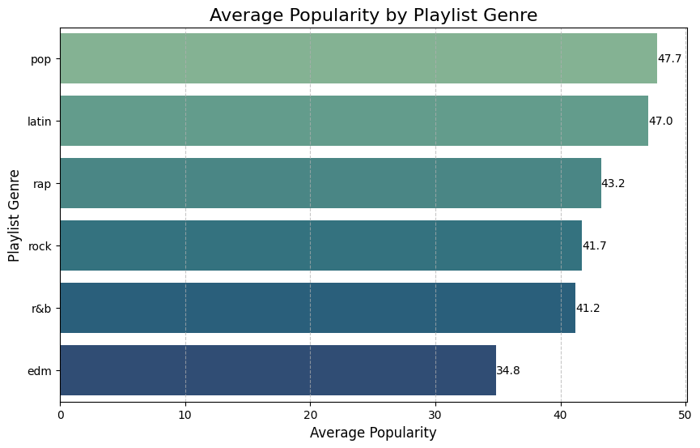
</a>
<p/>

Analisis:  
Genre pop merupakan genre paling populer dengan rata-rata mencapai 47% dibandingkan genre lainnya yang terdapat dalam playlist pengguna. Hal ini menunjukkan bahwa genre pop banyak diminati oleh pengguna umum karena sifatnya yang mudah didengar (*easy listening*). Posisi berikutnya ditempati oleh genre Latin, rap, rock, R&B, dan EDM.

---

### 2. **Distribusi jumlah lagu berdasarkan genre playlist.**

<p align='center'>
<a href="#" align='center'>
    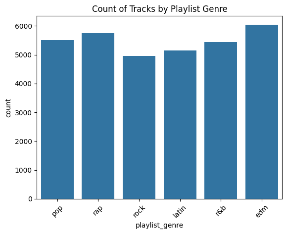
</a>
<p/>

Analisis:  
Namun, pada playlist dengan genre spesifik, jumlah lagu yang tersedia cukup banyak, mencapai total hingga 6.000 lagu. Genre ini diikuti oleh rap, pop, R&B, Latin, dan rock dalam urutan jumlah lagu yang tersedia.

---

### 3. **Distribusi jumlah lagu berdasarkan tahun rilis, dan tren apa yang terlihat pada distribusi ini.**

<p align='center'>
<a href="#" align='center'>
    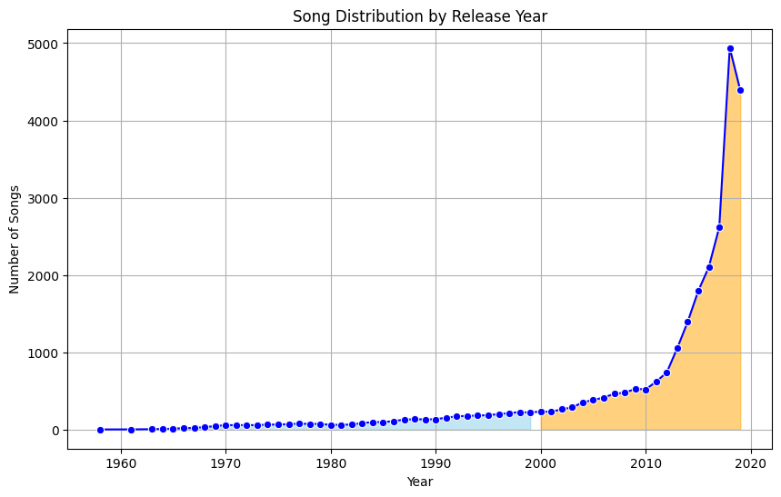
</a>
<p/>

Analisis:  
Distribusi perilisan lagu menunjukkan peningkatan signifikan sejak tahun 2010 dan mencapai puncaknya pada awal tahun 2019. Namun, terjadi penurunan pada tahun 2020. Hal ini dapat diasumsikan sebagai dampak dari semakin populernya Spotify sebagai layanan streaming, sehingga lagu-lagu yang dirilis di platform tersebut lebih banyak terbatas pada rentang tahun 2000–2020. Meski demikian, kemungkinan besar katalog lagu di platform ini akan terus diperbarui seiring waktu.

---

### 4. **Popularitas track berdasarkan genre playlist.**

<p align='center'>
<a href="#" align='center'>
    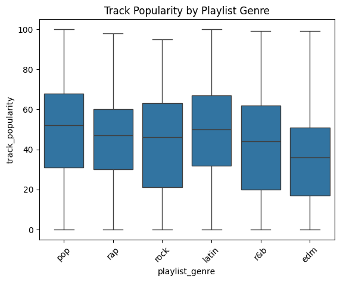
</a>
<p/>

Analisis:  
Distribusi popularitas lagu menurut genre playlist menunjukkan variasi yang signifikan. Rock dan R&B memiliki rentang popularitas yang luas, menandakan adanya perbedaan besar antara lagu yang sangat populer dan yang tidak. EDM menunjukkan distribusi yang lebih rendah dengan variasi terbatas. Rap memiliki rata-rata yang stabil, mencerminkan konsistensi penggemar meskipun tidak terlalu mainstream. Sedangkan Latin dan Pop menunjukkan popularitas yang konsisten tinggi, dengan rentang yang sempit. Secara keseluruhan, ini menggambarkan dinamika dan selera audiens yang berbeda-beda antar genre

---

### 5. **Hubungan antara fitur-fitur track seperti danceability, energy, loudness, dll., dengan popularitas lagu.**

<p align='center'>
<a href="#" align='center'>
    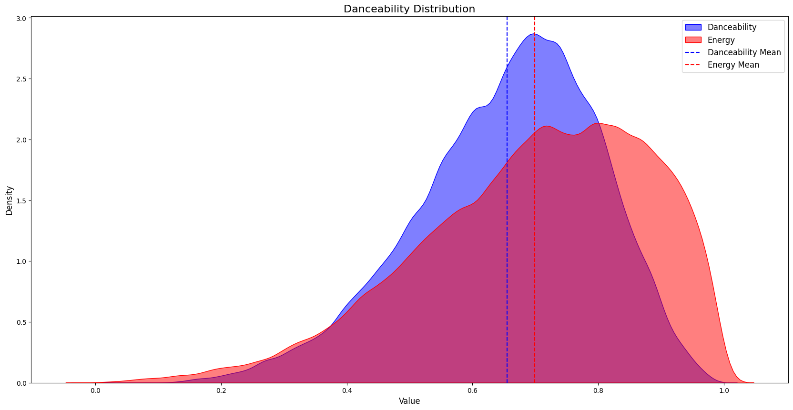
</a>
<p/>

Analisis:  
Distribusi Danceability dan Energy menunjukkan pola serupa dengan Danceability memiliki puncak lebih tinggi (>0.7), menandakan lebih banyak lagu yang danceable. Energy sedikit lebih tinggi dari Danceability secara rata-rata. Ada korelasi positif antara keduanya, di mana lagu dengan Danceability tinggi cenderung juga memiliki Energy tinggi, namun dengan ambang tertentu.

---

### 6. **Distribusi variabel numerik dalam lagu-lagu.**

<p align='center'>
<a href="#" align='center'>
    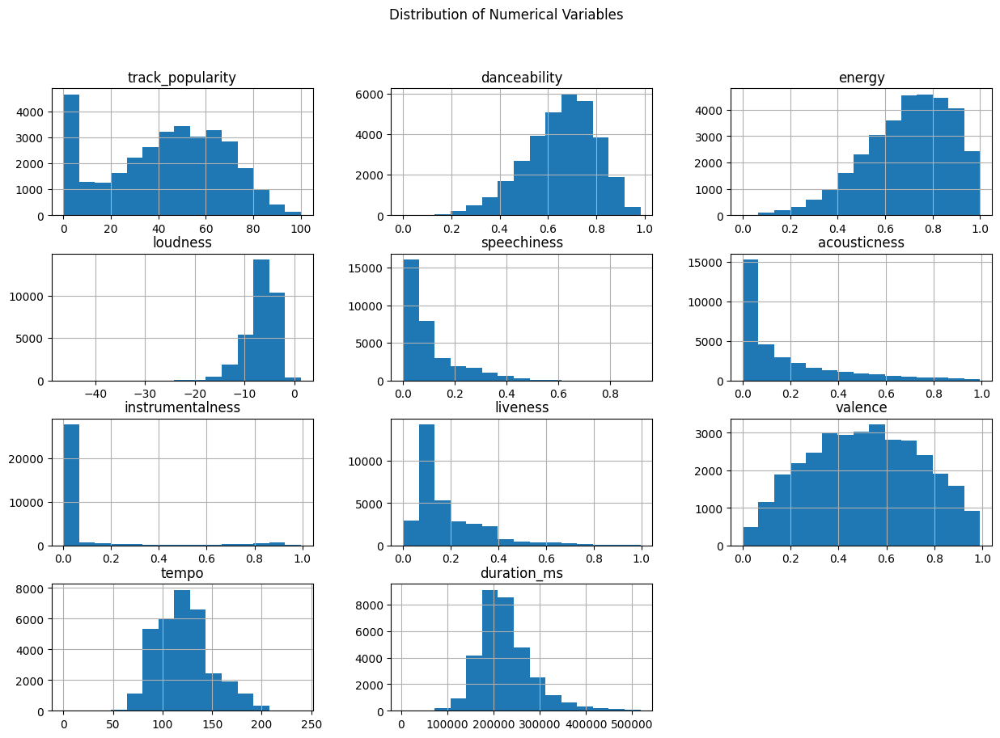
</a>
<p/>

Analisis:  
Dataset ini menunjukkan bahwa genre seperti EDM, pop, dan rap mendominasi dengan track yang lebih energik dan mudah danceable.
Track dengan tempo lebih rendah dan durasi lebih singkat lebih umum, dengan sebagian besar lagu tidak terlalu akustik atau instrumental.
Artis-artis besar seperti Martin Garrix dan Queen menunjukkan pengaruh yang signifikan dalam dataset ini, mencerminkan preferensi audiens terhadap nama-nama besar dan genre dominan.

---

### 7. **Distribusi popularitas di antara genre playlist dan subgenre.**

<p align='center'>
<a href="#" align='center'>
    
</a>
<p/>

Analisis:  
Melalui grafik sunburst, dapat dilihat bahwa genre seperti post-teen pop, hip-hop, reggaeton, dan pop EDM mendominasi, seiring dengan preferensi terhadap lagu-lagu yang danceable dan energetic. Sebaliknya, subgenre seperti gangster rap, new jack swing, hard rock, dan progressive electro house kurang diminati, mencerminkan selera audiens yang lebih terarah pada musik yang lebih mudah diterima dan lebih dinamis.

---

### 8. **Lagu dengan popularitas tertinggi berdasarkan artis.**

<p align='center'>
<a href="#" align='center'>
    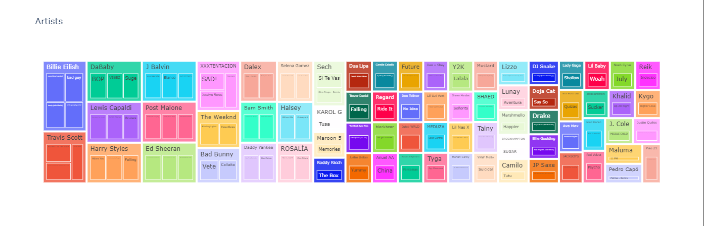
</a>
<p/>

Analisis:  
Billie Eilish, Travis Scott, dan DaBaby memegang popularitas tertinggi di Spotify, masing-masing dengan 1 hingga 3 lagu populer. Mereka mewakili genre pop, rap, Latin, EDM, dan rock, menunjukkan keberagaman musik yang digemari pendengar di platform ini.

---

### 9. **Tren popularitas lagu berdasarkan genre playlist dan subgenre.**

<p align='center'>
<a href="#" align='center'>
    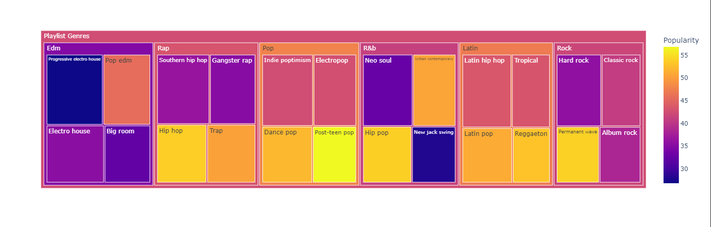
</a>
<p/>

Analisis:  
Analisis ini menggambarkan bagaimana popularitas lagu berkembang berdasarkan genre atau subgenre dari waktu ke waktu.

---

### 10. **Tren popularitas lagu dari waktu ke waktu dalam genre tertentu.**

<p align='center'>
<a href="#" align='center'>
    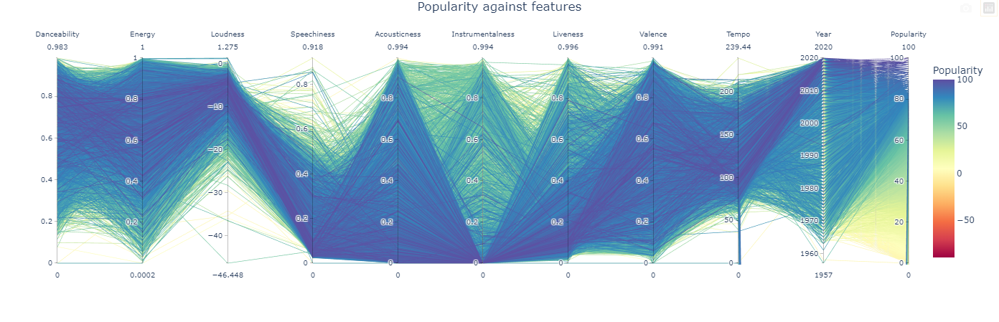
</a>
<p/>

Analisis:  
1. Lagu yang memiliki potensi untuk populer adalah lagu-lagu yang memiliki suasana yang mengundang pendengar untuk menari.
2. Valensi lagu memiliki pengaruh besar terhadap popularitas. Lagu dengan valensi tinggi, seperti lagu yang ceria, positif, dan bahagia, cenderung lebih populer dibandingkan dengan lagu dengan valensi rendah.
3. Lagu dengan tempo yang lebih tinggi tidak terlalu populer, sedangkan lagu dengan tempo moderat hingga rendah justru lebih banyak didengarkan, yang berarti lebih populer.
4. Lagu dengan durasi antara 2 hingga 5 menit adalah yang paling optimal dalam hal popularitas.
---

### 11. **Interaksi antara berbagai fitur dan popularitas lagu.**

<p align='center'>
<a href="#" align='center'>
    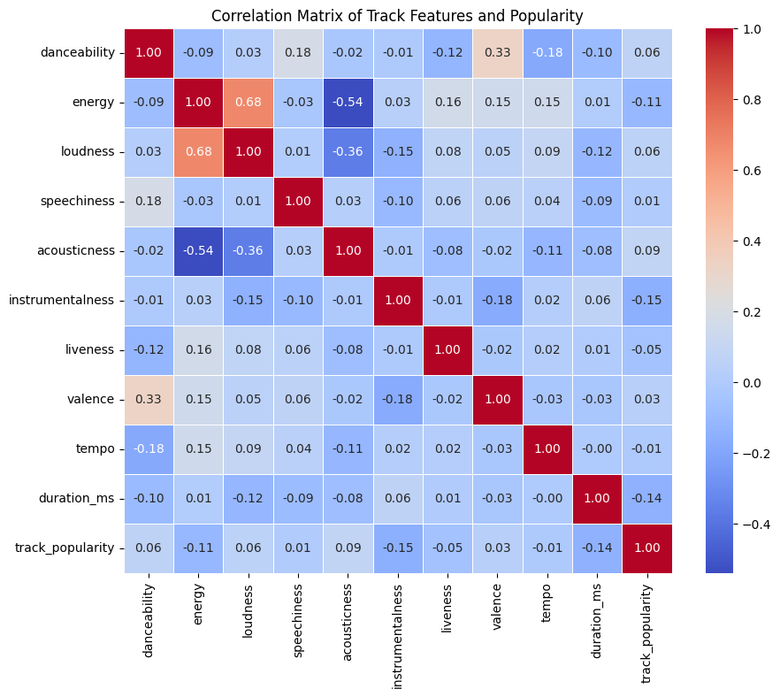
</a>
<p/>

Analisis:  
Hubungan antara antar fitur dengan presentasi yang lebih intepretasinya lebih mudah dan straight to the point

---

### 12. **Tren popularitas lagu berdasarkan genre playlist dan subgenre dari waktu ke waktu.**

<p align='center'>
<a href="#" align='center'>
    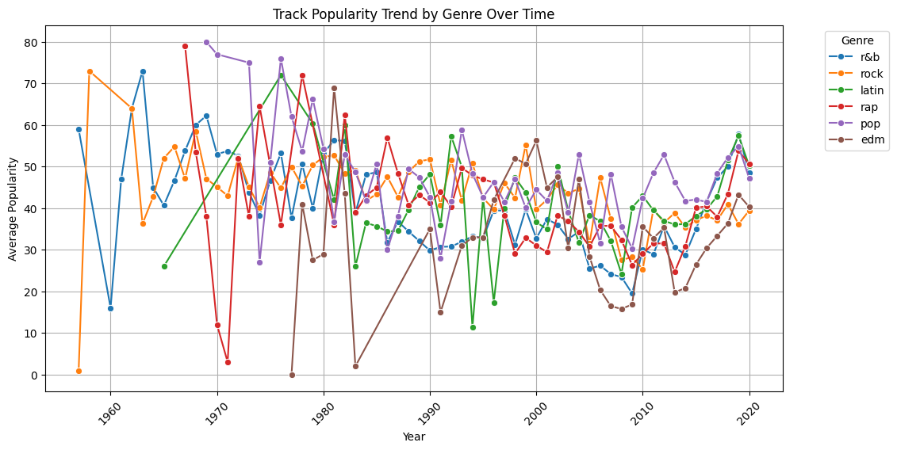
</a>
<p/>

Analisis:  
Grafik menunjukkan fluktuasi signifikan dalam popularitas lagu per genre dari tahun ke tahun, mencerminkan perubahan selera pendengar Spotify yang dinamis. Beberapa genre mengalami peningkatan konsisten, sementara yang lain mengalami penurunan, mencerminkan pergeseran preferensi audiens. Fluktuasi lebih besar terlihat pada genre seperti EDM dan pop, sementara genre lain seperti rock dan R&B lebih stabil. Tren ini menunjukkan respons audiens terhadap artis baru dan fenomena musik global.

## KNN adn KMeans Recommendation Systems
<p align='center'>
<a href="#" align='center'>
    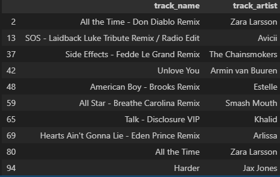
</a>
<p/>
Apabila diinputkan untuk pembuatan playlist dengan title track "Shape Of You" oleh Ed Sheeran dengan properti yang sama, similarty distance dan cluster akan membantu generasi playlist berdasarkan karakteristik yang sama seperti berikut.

<p align='center'>
<a href="#" align='center'>
    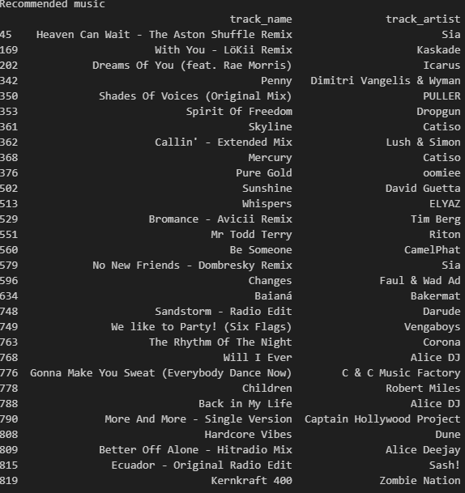
</a>
<p/>
Apabila diinputkan untuk pembuatan playlist dengan title track "The Dance Of Eternity" dengan properti yang sama, similarty distance dan cluster akan membantu generasi playlist berdasarkan karakteristik yang sama seperti berikut.

</div>
<br>

<!--KESIMPULAN-->

## Kesimpulan

<div align='justify'>

### 5.1 Pernyataan Masalah yang Dibahas

Penelitian ini bertujuan untuk menganalisis popularitas lagu di Spotify berdasarkan genre dan subgenre, serta untuk mengeksplorasi tren musik dari berbagai perspektif. Masalah utama yang dibahas adalah bagaimana faktor-faktor seperti tempo, danceability, energy, dan genre memengaruhi popularitas lagu, serta bagaimana tren popularitas lagu berkembang dari tahun ke tahun.

### 5.2 Metodologi yang Digunakan
Methodologi yang digunakan untuk penelitian ini adalah
KDD Deep Analysis
1. Import Requirements
2. Data Preparation
3. Data Assessing 
4. Data Cleaning
5. Exploratory Data Analysis (EDA)
6. Analysis Result
7. Recomendation Systems : KNN and K-Means 
8. Knowledge, Insight, Implication and Benefit

### 5.3 Wawasan Menarik yang ditemukan

Dari hasil analisis eksploratori data (EDA), ditemukan beberapa wawasan menarik, antara lain:

* Genre seperti pop, rap, dan EDM mendominasi platform Spotify, dengan lagu-lagu dalam genre tersebut cenderung lebih energik dan danceable.
Lagu dengan tempo lebih rendah dan durasi lebih singkat memiliki popularitas yang lebih tinggi.
* Fluktuasi popularitas antar genre menunjukkan adanya perubahan selera pengguna yang dinamis, dengan beberapa genre mengalami peningkatan signifikan, sementara yang lainnya cenderung stabil atau menurun.
* KNN dan KMEANS dapat membantu untuk membentuk sebuah recomendation system untuk data yang telah diolah berdasarkan properti yang sama, seperti karateristik fitur yang telah dipresentasikan dalam analisis diatas, dan cukup akurat apabila dilihat dari observasi yang telah digenerasi oleh model tersebut.

### 5.4 Manfaat analisis

Analisis ini memberikan wawasan yang berguna bagi para pembuat musik, artis, dan pengelola platform streaming musik untuk memahami preferensi audiens. Dengan mengetahui genre dan fitur lagu yang paling populer, mereka dapat menyesuaikan produksi dan promosi lagu untuk menarik lebih banyak pendengar. Selain itu, wawasan mengenai tren tahunan membantu memahami perubahan selera musik yang dapat digunakan untuk merencanakan rilis lagu atau album di masa depan.

## Others

### **Usage**
1. Clone Repository
Clone repository ini :
    
    ```
    git clone https://github.com/Hazarddrips/Proyek_Akhir_Analisis_Big_Data.git
    ```
    ```
    cd Proyek_Akhir_Analisis_Big_Data
    ```
2. Install Dependencies
Install paket yang dibutuhkan:
    ```
    pip install -r requirements.txt
    ```
3. Jalankan Jupyter Notebook
Buka file analisisbigdata.ipynb dengan Jupyter:
    ```
    jupyter notebook analisisbigdata.ipynb
    ```
4. Dataset
Pastikan file `spotify_songs.csv` ada di direktori yang sama dengan notebook.

5. Jelajahi Analisis
Ikuti langkah-langkah di notebook untuk pembersihan dan analisis data.

---

### **Repository Structure**
- `spotify_songs.csv`: Dataset berisi data lagu-lagu Spotify, termasuk informasi seperti nama lagu, artis, genre, durasi, dan metrik lainnya yang digunakan untuk analisis.
- `.ipynb`: Jupyter Notebook yang berisi langkah-langkah analisis data, mulai dari pembersihan data hingga eksplorasi dan visualisasi untuk menemukan wawasan yang relevan dari dataset.
- `README.md`: Pengantar dan gambaran umum proyek, termasuk instruksi penggunaan, tujuan analisis, serta bagaimana cara menjalankan dan mereplikasi analisis ini.
---

### **References**
- Dataset: [TidyTuesday](https://github.com/rfordatascience/tidytuesday)
- Additional Resources: 
    * https://github.com/SPARC-FAIR-Codeathon/QuiltedTutorials
    * https://github.com/SPARC-FAIR-Codeathon/KnowMore

</div>
<br>